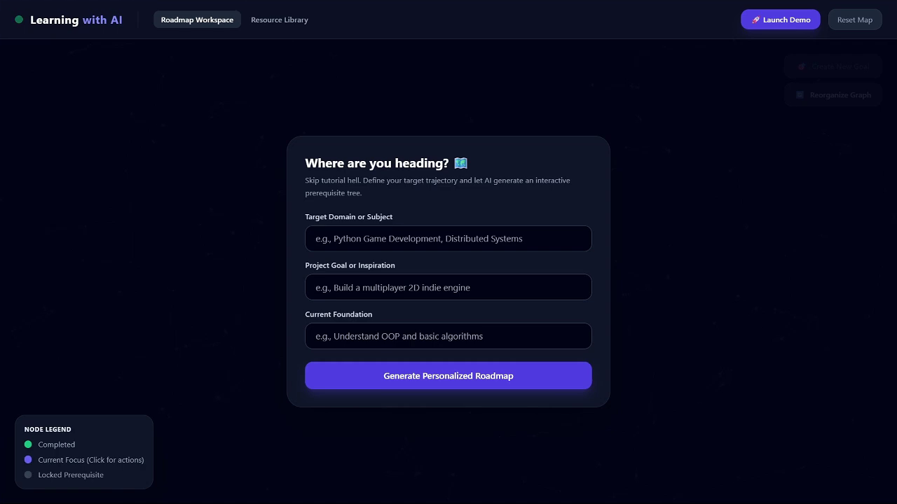
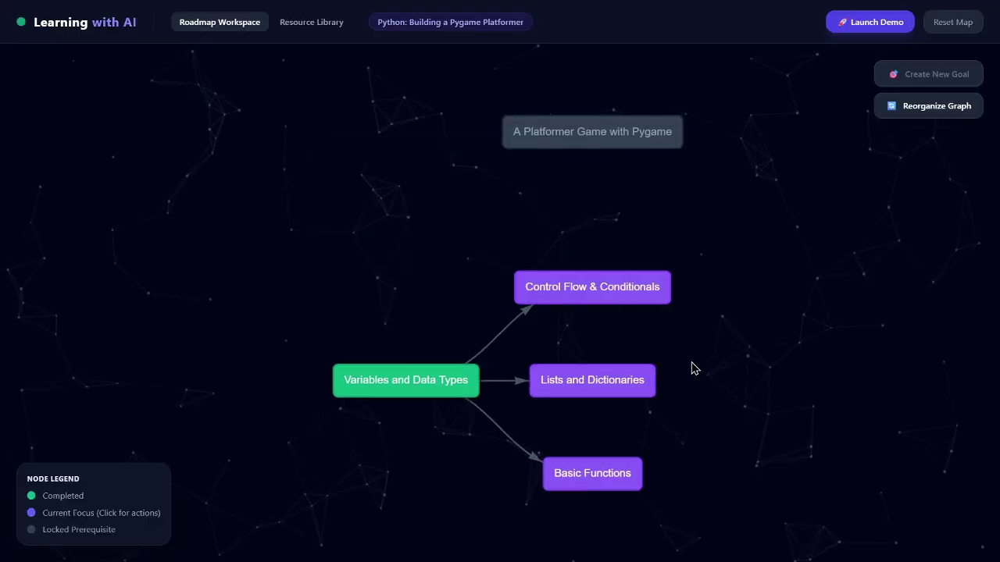
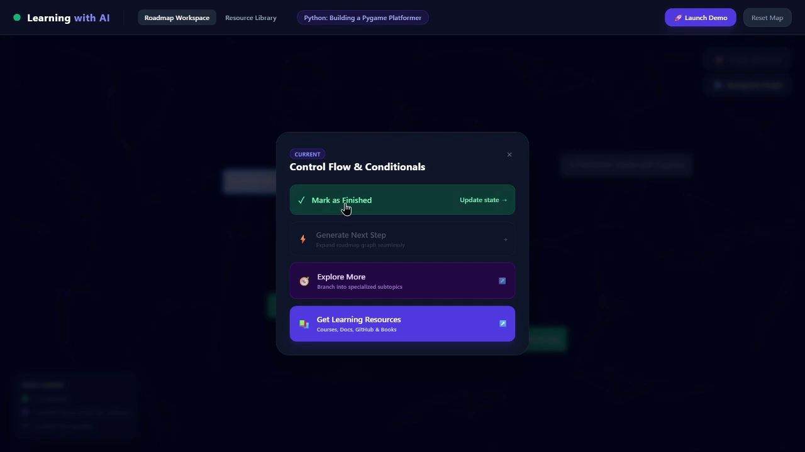
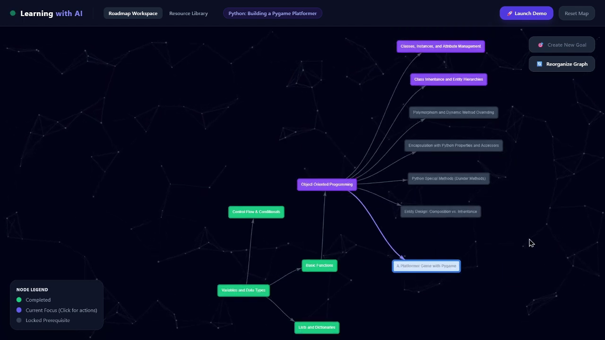

# Learning Mapper

A small Flask-based web app that helps organize and explore learning resources, with a lightweight AI service for content assistance.

---

## Features
- Organize and browse resources via a simple web UI
- Minimal Flask backend served from `app.py`
- AI helper service in `services/ai_service.py` for suggestions and enrichment
- Static assets and templates in `static/` and `templates/`

## Tech Stack
- Python 3.8+
- Flask
- Simple frontend (HTML/CSS/JS)

## Quick Start

1. Create and activate a virtual environment:

```bash
python -m venv venv
# Windows
venv\Scripts\activate
# macOS / Linux
source venv/bin/activate
```

2. Install dependencies:

```bash
pip install -r requirements.txt
```

3. Run the app locally:

```bash
# Simple run (uses app.py directly)
python app.py

# Or, if using Flask run style:
set FLASK_APP=app.py    # Windows
export FLASK_APP=app.py # macOS / Linux
flask run
```

4. Open your browser at `http://127.0.0.1:5000`.

## Project Layout

- `app.py` — application entry point
- `services/ai_service.py` — AI-related helper functions and endpoints
- `templates/` — HTML templates (`index.html`, `resources.html`)
- `static/` — CSS and JS assets
- `schemas.py` — data schema helpers

## Configuration & Environment
- Add any runtime configuration or secrets as environment variables.
- Typical variables: `PORT`, any API keys used by `services/ai_service.py`.

## Development Notes
- Frontend scripts are in `static/js/` — modify and refresh the page to test changes.
- Use the console and Flask logs to debug backend behavior.

## License
See `LICENSE.md`.

---







